# MediConnect - Telemedicine & Diagnostic Management System

[](https://flutter.dev)
[](https://firebase.google.com)
[](https://flask.palletsprojects.com/)
[](https://ai.google.dev/)
[](#)

MediConnect is an end-to-end, production-grade Telemedicine and Diagnostic Management platform built with **Flutter**, **Firebase**, **Python Flask**, and **Google Gemini AI**. The platform bridges **Patients**, **Doctors**, **Diagnostic Centres**, and **System Administrators**, delivering real-time consultation booking, AI-assisted health triage, interactive lab test management, automated PDF report generation, and official credential verification via DGHS & BMDC registration codes.

---

## 📑 Table of Contents

- [System Architecture & Tech Stack](#-system-architecture--tech-stack)
- [Key Features by Role](#-key-features-by-role)
  - [1. Patient Mobile & Web Portal](#1-patient-mobile--web-portal)
  - [2. Doctor Web & Mobile Portal](#2-doctor-web--mobile-portal)
  - [3. Diagnostic Centre Web & Mobile Portal](#3-diagnostic-centre-web--mobile-portal)
  - [4. Super Admin Web Portal](#4-super-admin-web-portal)
- [5-Stage Diagnostic Lab Test Pipeline](#-5-stage-diagnostic-lab-test-pipeline)
- [Project Directory Structure](#-project-directory-structure)
- [Database Schema & Data Models](#-database-schema--data-models)
- [Credential Verification Engine](#-credential-verification-engine)
- [AI Health Assistant (MediBot)](#-ai-health-assistant-medibot)
- [Installation & Setup Guide](#-installation--setup-guide)
  - [Mobile & Web App (Flutter)](#mobile--web-app-flutter)
  - [Web Admin & Doctor/Diagnostic Portal (Python Flask)](#web-admin--doctordiagnostic-portal-python-flask)
- [Deployment & Cloud Host Setup](#-deployment--cloud-host-setup)

---

## 🏗 System Architecture & Tech Stack

MediConnect utilizes a modular, decoupled architecture adhering to Clean Architecture principles and strict Role-Based Access Control (RBAC).

```
                      ┌─────────────────────────────────────────┐
                      │              MediConnect                │
                      └────────────────────┬────────────────────┘
                                           │
         ┌───────────────────┬─────────────┴───────┬────────────────────┐
         │                   │                     │                    │
┌────────▼────────┐ ┌────────▼────────┐ ┌──────────▼─────────┐ ┌─────────▼────────┐
│  Patient App    │ │   Doctor App    │ │ Diagnostic Centre │ │ Admin Web Portal │
│ (Flutter Multi) │ │ (Flutter Multi) │ │  (Flutter Multi)  │ │  (Python Flask)  │
└────────┬────────┘ └────────┬────────┘ └──────────┬──────────┘ └────────┬────────┘
         │                   │                     │                     │
         └───────────────────┴──────────┬──────────┴─────────────────────┘
                                        │
                         ┌──────────────▼──────────────┐
                         │   Firebase Cloud Backend    │
                         │ ├─ Firebase Authentication  │
                         │ ├─ Cloud Firestore DB       │
                         │ └─ Firebase Storage         │
                         └──────────────┬──────────────┘
                                        │
                         ┌──────────────▼──────────────┐
                         │   Google Gemini 1.5 Flash   │
                         │ (MediBot AI Health Engine)  │
                         └─────────────────────────────┘
```

### Technology Highlights
- **Frontend App**: Flutter 3.x (Dart), Material Design 3, Riverpod & Provider State Management, Google Fonts (Plus Jakarta Sans).
- **Backend & Cloud Infrastructure**: Firebase Authentication, Cloud Firestore (Real-time DB), Firebase Storage (Base64 & PDF document hosting).
- **Web Portal Backend**: Python Flask with Jinja2 templates, REST endpoints, and security middleware.
- **AI Integration**: Google Gemini API via `ChatbotService` for intelligent patient symptom analysis and doctor specialization recommendations.
- **PDF & Report Engine**: High-resolution PDF compilation via `pdf` and `printing` packages with interactive in-app viewers (`PdfPreview`).

---

## ✨ Key Features by Role

### 1. Patient Mobile & Web Portal
- **Doctor Discovery & Booking**: Real-time doctor search filtered by specialization, rating, hospital affiliation, and consultation fee.
- **MediBot AI Health Triage**: Interactive AI assistant that evaluates patient symptoms, answers medical queries, and suggests appropriate specialists.
- **Interactive Payments**: Support for online payments (bKash / Nagad / Card with OTP & PIN modal flow), pay-at-lab, and cash-on-visit.
- **E-Prescription Viewer**: High-resolution PDF viewer for doctor prescriptions (`PdfPreview`), printable and downloadable.
- **Diagnostic Lab Test Ordering**: Order lab tests with **Home Sample Collection** (৳150 biohazard fee) or **Centre Visit** options. Real-time 5-stage tracking timeline.

### 2. Doctor Web & Mobile Portal
- **Chamber Management**: Add and manage practice chambers with full address, contact numbers, visiting hours, and editable consultation fees. Synchronizes live to Firebase for patient discovery.
- **Interactive Schedule & Time Slots**: Select active practice days (Saturday–Friday), shift start/end times, and slot durations (15m, 20m, 30m, 45m, 60m). Features auto-generated interactive time slot chips.
- **Isolated Patient Directory**: Doctors access ONLY their assigned patients who have booked or completed consultations.
- **Earnings & Financial Analytics**: Comprehensive dashboard tracking total revenue, online vs in-person cash breakdowns, and paid patient histories.
- **E-Prescription Generator**: Write digital prescriptions with medicine dosage, frequency, diagnostic test recommendations, and clinical notes.

### 3. Diagnostic Centre Web & Mobile Portal
- **Official Credential Registration**: Mandatory registration including **DGHS Registration Code**, **Chief Pathologist Name**, and **Pathologist BMDC Reg. Number**.
- **Isolated Lab Test Pipeline**: Centre-specific dashboard displaying ONLY bookings and patient records matching the facility ID.
- **Collector Dispatch**: Assign certified Phlebotomists / Sample Collectors with contact details and biohazard equipment info.
- **PDF Report Generation & Printing**: Input parameter readings, normal ranges, and Pathologist findings to publish instant verified PDF diagnostic reports.

### 4. Super Admin Web Portal
- **Direct Admin Authentication**: Dedicated secure route (`/admin`) protecting admin login credentials from public portals.
- **Official Credential Verification**: Review doctor BMDC codes and diagnostic centre **DGHS Registration Codes** & **Pathologist BMDC Numbers** before approving facility activation.
- **System Monitoring**: System statistics, disease outbreak heatmaps, user restrictions, and published article oversight.

---

## 🔬 5-Stage Diagnostic Lab Test Pipeline

```mermaid
flowchart TD
    subgraph Stage 1: Patient Discovery & Booking
        A[Patient App: Select Diagnostic Centre] --> B[Pick Tests: CBC, Lipid Profile, etc.]
        B --> C[Select Collection Mode: Home Visit vs Walk-in]
        C --> D[Pay via bKash / Nagad / Cash]
        D --> E[Write Booking to Firestore `lab_test_bookings`]
    end

    subgraph Stage 2: Verification & Dispatch
        E --> F[Diagnostic Web Portal Notification]
        F --> G[Centre Admin Approves Booking]
        G --> H[Assign Certified Phlebotomist / Collector]
        H --> I[Update Status: `collectorAssigned`]
    end

    subgraph Stage 3: Sample Collection & Transit
        I --> J[Phlebotomist Visits Patient / Accepts Walk-in]
        J --> K[Sample Collected with Biohazard Barcode]
        K --> L[Update Status: `sampleCollected` -> `processing`]
    end

    subgraph Stage 4: Lab Analysis & Report Generation
        L --> M[Automated Analyzer Test Processing]
        M --> N[Lab Technician Inputs Parameter Readings]
        N --> O[Generate Verified PDF Diagnostic Report]
        O --> P[Upload Report to Firebase & Set `status: completed`]
    end

    subgraph Stage 5: Patient Notification & Live PDF View
        P --> Q[Patient Push Notification Alert]
        Q --> R[Patient App 5-Stage Timeline Updated]
        R --> S[Patient Views/Downloads PDF Report]
    end
```



---

## 📂 Project Directory Structure

```
telemedicine/
├── Admin/                          # Python Flask Web Portal & Admin Backend
│   ├── app.py                      # Core Flask Server, Auth, & Firestore Routes
│   ├── requirements.txt            # Python Dependencies (Flask, firebase-admin)
│   └── templates/                  # Jinja2 HTML Templates
│       ├── admin/                  # Super Admin Dashboard & Verification
│       ├── doctor/                 # Doctor Portal (Chambers, Schedule, Earnings, Patients)
│       ├── diagnostic/              # Diagnostic Centre Portal (Bookings, Catalog, Patients)
│       └── register_diagnostic.html# Official DGHS & BMDC Registration Form
├── lib/                            # Flutter Multi-Platform Application
│   ├── main.dart                   # Application Entry Point
│   ├── core/                       # Services, Providers, Themes, & Widgets
│   │   ├── services/               # Firestore, Auth, PDF Generator, Chatbot Services
│   │   └── theme/                  # App Theme & Color Tokens
│   ├── models/                     # Data Models (Doctor, Patient, Chamber, LabTest)
│   └── screens/                    # UI Screens by Module
│       ├── auth/                   # Authentication & Verification Screens
│       ├── patient/                # Patient Home, Booking, Prescriptions, Lab Tests
│       ├── doctor/                 # Doctor Dashboard, Chambers, Schedule, Earnings
│       └── diagnostic_centre/      # Diagnostic Centre Verification & Lab Pipeline
├── diagnostic_booking_pipeline.md  # Detailed Diagnostic Workflow Documentation
├── firestore.rules                 # Cloud Firestore Security Rules
├── storage.rules                   # Firebase Storage Access Rules
└── pubspec.yaml                    # Flutter Dependencies
```

---

## 🗄 Database Schema & Data Models

### Core Collections in Cloud Firestore:

1. **`users`**: User profile credentials (`role`: `patient`, `doctor`, `diagnostic_centre`, `admin`).
2. **`doctors`**: Doctor profile data, BMDC code, qualifications, `chambers` array, and `availability` schedules.
3. **`diagnostic_centres`**: Diagnostic facility profile, `dghsCode`, `pathologistName`, `pathologistBmdcNumber`, `tradeLicenseNumber`, and verification status.
4. **`chambers`**: Top-level practice location records linked by `doctorId`.
5. **`appointments`**: Consultation bookings with payment status, fee, meeting links, and digital prescription objects.
6. **`lab_test_bookings`**: Diagnostic lab test bookings tracking the 5-stage lifecycle, phlebotomist assignment, findings, and `reportUrl`.

---

## 🛡 Credential Verification Engine

MediConnect mandates official health ministry verification before provider accounts are unlocked:

- **Doctor Verification**: Super Admin verifies the doctor's Bangladesh Medical and Dental Council (**BMDC**) Registration Number against official databases.
- **Diagnostic Centre Verification**: Super Admin validates the Directorate General of Health Services (**DGHS**) Registration Code and the Chief Pathologist's **BMDC Registration Number**.
- **Pending Safeguard**: Providers attempting to log in prior to admin approval are safely held at the `verification_pending` screen displaying their submitted credentials.

---

## 🤖 AI Health Assistant (MediBot)

Integrated via `ChatbotService` utilizing **Google Gemini 1.5 Flash**:

- Evaluates patient symptom descriptions in natural language.
- Recommends appropriate medical specialists (e.g. *Cardiologist*, *Dermatologist*, *Neurologist*).
- Provides preliminary health advice and urgency triage (Low, Medium, Emergency).

---

## 🚀 Installation & Setup Guide

### Prerequisites
- [Flutter SDK](https://flutter.dev/docs/get-started/install) (v3.19.0 or higher)
- [Python](https://www.python.org/downloads/) (v3.10 or higher)
- [Firebase CLI](https://firebase.google.com/docs/cli)

### Mobile & Web Application (Flutter)

1. **Clone the Repository**:
   ```bash
   git clone https://github.com/deba75/medical-management-system.git
   cd medical-management-system
   ```

2. **Install Flutter Dependencies**:
   ```bash
   flutter pub get
   ```

3. **Configure Firebase**:
   Ensure `google-services.json` (Android) and `firebase_options.dart` are linked to your Firebase project.

4. **Run the Application**:
   ```bash
   # Run on Chrome Web
   flutter run -d chrome

   # Run on Android Emulator / Physical Device
   flutter run -d android
   ```

### Web Admin & Doctor/Diagnostic Portal (Python Flask)

1. **Navigate to Admin Directory**:
   ```bash
   cd Admin
   ```

2. **Install Python Dependencies**:
   ```bash
   pip install -r requirements.txt
   ```

3. **Service Account Key**:
   Place your Firebase Service Account Key JSON file at `Admin/serviceAccountKey.json`.

4. **Launch Flask Web Portal**:
   ```bash
   python app.py
   ```
   Access the web portal at `http://127.0.0.1:5000`.

---

## ☁️ Deployment & Cloud Host Setup

- **Live Web Portal**: Deployed on Render / Cloud Host linked to GitHub main branch.
- **Firebase Host**: Production Firestore DB & Storage rules configured via `firestore.rules` and `storage.rules`.
