# End-to-End Pipeline: Diagnostic Center Booking to PDF Result Viewing

This document details the architecture, data flow, Firestore schemas, and step-by-step 5-stage lifecycle for lab test ordering, sample collection, laboratory analysis, and live PDF report viewing in the **MediConnect** platform.

---

## 1. Pipeline Architectural Overview

```mermaid
flowchart TD
    subgraph Stage 1: Patient Discovery & Booking
        A[Patient App: Browse Diagnostic Centres] --> B[Select Lab Tests CBC, Lipid, etc.]
        B --> C[Choose Sample Collection Mode: Home Visit vs Walk-in Lab]
        C --> D[Pay via bKash / Nagad / Card or Pay-on-Visit]
        D --> E[Write Booking to Firestore `lab_test_bookings`]
    end

    subgraph Stage 2: Verification & Dispatch
        E --> F[Diagnostic Web/Mobile Portal Notification]
        F --> G[Centre Admin Approves Booking]
        G --> H[Assign Certified Phlebotomist / Collector]
        H --> I[Update Status: `collectorAssigned`]
    end

    subgraph Stage 3: Sample Collection & Transit
        I --> J[Phlebotomist Visits Patient or Accepts Walk-in]
        J --> K[Sample Collected with Biohazard & Barcode ID]
        K --> L[Update Status: `sampleCollected` -> `processing`]
    end

    subgraph Stage 4: Lab Analysis & Report Generation
        L --> M[Lab Analyzer Tests & Parameter Verification]
        M --> N[Lab Technician Inputs Findings & Remarks]
        N --> O[Generate Verified PDF Diagnostic Report]
        O --> P[Upload PDF to Firebase Storage & Update `status: completed`]
    end

    subgraph Stage 5: Patient Notification & Live PDF View
        P --> Q[Patient Push Notification & Email Alert]
        Q --> R[Patient App 5-Stage Live Timeline Updated]
        R --> S[Patient Views/Downloads PDF Report]
    end
```



---

## 2. Core Firestore Data Model (`lab_test_bookings`)

All bookings sync in real time across the **Patient Mobile App**, **Diagnostic Web Portal**, and **Backend Services** using the following schema:

```json
{
  "id": "BK-2026-9812",
  "patientId": "USR-88231",
  "patientName": "Debabrata Das",
  "patientPhone": "+880 1711-223344",
  "patientEmail": "dabasis534@gmail.com",
  "familyMemberId": null,
  "familyMemberName": null,
  "diagnosticCentreId": "DC-SQUARE-01",
  "diagnosticCentreName": "Square Hospital & Diagnostic Centre",
  "tests": [
    {
      "testId": "TEST-CBC-01",
      "testName": "Complete Blood Count (CBC)",
      "category": "Hematology",
      "price": 450.0
    },
    {
      "testId": "TEST-LIPID-02",
      "testName": "Lipid Profile",
      "category": "Biochemistry",
      "price": 1200.0
    }
  ],
  "status": "completed",
  "collectionType": "homeSample",
  "paymentMethod": "online",
  "paymentStatus": "paid",
  "scheduledDate": "2026-07-30T10:00:00.000Z",
  "timeSlot": "09:00 AM - 12:00 PM",
  "address": "18/F West Panthapath, Dhanmondi, Dhaka",
  "totalAmount": 1650.0,
  "homeCollectionFee": 150.0,
  "phlebotomistName": "Mr. Tareq Hasan (Sr. Phlebotomist)",
  "phlebotomistPhone": "+880 1712-998877",
  "phlebotomistEquipment": "Sterile Biohazard Transport Box & Digital Thermometer",
  "testResults": "Hemoglobin: 14.5 g/dL (Normal). WBC: 7,200/mcL. Total Cholesterol: 185 mg/dL. Triglycerides: 140 mg/dL.",
  "reportUrl": "https://firebasestorage.googleapis.com/v0/b/telemedicine-df.appspot.com/o/reports%2FRX_88231_CBC.pdf",
  "createdAt": "2026-07-29T19:30:00.000Z",
  "updatedAt": "2026-07-29T20:15:00.000Z"
}
```

---

## 3. Stage-by-Stage Operational Workflow

### Stage 1: Patient Discovery, Test Selection & Booking Creation
- **Patient Action**:
  1. Patient selects a verified Diagnostic Centre (e.g. *Square Hospital & Diagnostic Centre*) from the Patient App.
  2. Selects required tests (*CBC*, *Lipid Profile*, *Thyroid Panel*) from the active catalog.
  3. Chooses collection preference:
     - **Home Sample Collection** (adds ৳150 transportation & biohazard fee).
     - **Lab Visit / Walk-in**.
  4. Selects convenient date and time slot (`09:00 AM - 12:00 PM`).
  5. Selects Payment Method (`bKash`, `Nagad`, `Card`, or `Pay at Lab`).
     - For online payments, completes interactive **bKash Gateway** (Number -> OTP -> PIN verification).
  6. Booking document is created in Firestore `lab_test_bookings` collection.

### Stage 2: Diagnostic Centre Notification & Phlebotomist Assignment
- **Diagnostic Portal Action**:
  1. Centre Admin receives real-time notification on their **Diagnostic Web Portal** (`/diagnostic/bookings`).
  2. Admin verifies test availability and approves booking.
  3. Admin assigns a qualified Phlebotomist / Sample Collector with contact details and biohazard equipment details.
  4. Booking status updates to `collectorAssigned`.

### Stage 3: Sample Collection & Specimen Transit
- **Collector & Lab Action**:
  1. Phlebotomist visits patient address or receives walk-in patient at centre.
  2. Collects blood/urine sample into vacuum blood tubes with barcode tracking IDs.
  3. Specimen stored in temperature-controlled transport box (2°C - 8°C).
  4. Status updates to `sampleCollected` and then `processing` upon arrival at the central lab analyzer.

### Stage 4: Laboratory Analysis, Result Recording & PDF Report Generation
- **Lab Technician Action**:
  1. Automated analyzer processes specimens.
  2. Lab Technician reviews parameter readings on Diagnostic Web Portal (`/diagnostic/booking/<id>/detail`).
  3. Technician inputs test parameter values, normal ranges, and Pathologist findings.
  4. Clicks **Publish Report & Generate PDF**.
  5. System generates standardized PDF diagnostic report containing:
     - Patient & Diagnostic Centre credentials.
     - Parameter test table with reference ranges and abnormal flags.
     - Digital Pathologist signature & barcode verification.
     - Secure URL saved to `reportUrl` in Firestore `lab_test_bookings`.
     - Status updates to `completed`.

### Stage 5: Push Notification & Real-Time Patient PDF View
- **Patient Action**:
  1. Patient receives instant push notification (*"Your Lab Report for CBC & Lipid Profile is ready!"*).
  2. Patient opens **My Bookings / Test Tracking Screen** in Patient App (`lab_test_booking_screen.dart`).
  3. 5-Stage Live Timeline displays all completed milestones with green checkmarks.
  4. Patient taps **View / Download PDF Report**.
  5. Built-in PDF viewer renders report document for printing, sharing, or doctor consultation!

---

## 4. Status Transition Matrix

| Status Code | Display Name | Trigger Event | Next Action |
| :--- | :--- | :--- | :--- |
| `pending` | Pending Verification | Patient submits booking | Centre Admin reviews & assigns collector |
| `collectorAssigned` | Phlebotomist Assigned | Centre assigns collector | Collector departs for sample collection |
| `sampleCollected` | Sample Collected | Collector scans sample barcode | Specimen transported to central lab |
| `processing` | In Lab Processing | Lab analyzer receives specimen | Technician inputs findings & remarks |
| `completed` | Report Published | Technician publishes PDF | Patient views/downloads PDF report |

---

## 5. Security & Isolation Guarantee

- **Patient Isolation**: Diagnostic Centres only access booking and patient records where `diagnosticCentreId == centre_id`.
- **Encryption**: PDF reports in Firebase Storage use signed token URLs accessible only to the authenticated patient and authorized healthcare providers.
